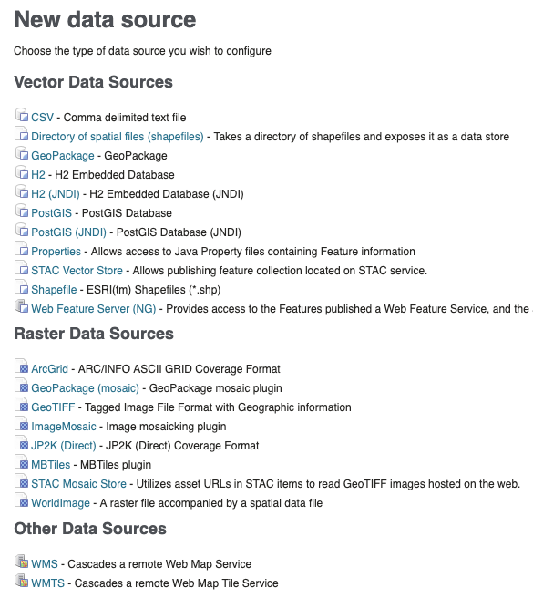
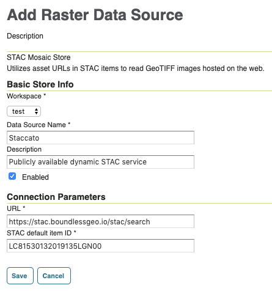
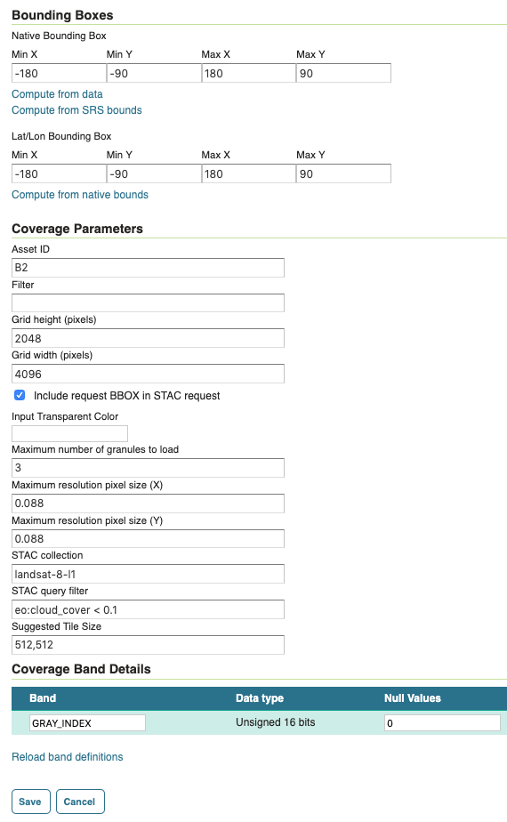

# STAC Plugin for GeoTools/GeoServer

## About

The [STAC](https://github.com/radiantearth/stac-spec) plugin allows GeoTools to create a raster store backed by a 
dynamic STAC catalog and publish 
GeoServer layers to dynamically render the imagery returned from STAC queries.  The plugin additionally supports a 
vector store.  This is very much a prototype and work in progress.  This project would not be possible without 
major contributions from Niels Charlier, Devon Tucker, and Torben Barsballe.  Any and all issues, feature requests, 
and contributions are welcome.

Several of the key enabling components in GeoTools that allow dynamic mosaics have only recently been added. There are 
more enhancements on the horizon that will overcome many of the assumptions made in GeoTools that configuration and 
imagery are located on a file system local to the GeoServer deployment. As the underlying code evolves to be more cloud 
friendly, so will this plugin. 

## Usage

Simply include the imagemosaic-stac jar file in your geoserver deployment.  The raster store and vector store 
will become available from the GeoServer admin UI.  When selecting a new data source for a new store, you should 
see both the "STAC VectorStore" and the "STAC Mosaic Store".

## STAC Mosaic Store Configuration  

The mosaic store is quite simple to configure.  You simply need to point to a valid STAC search endpoint.  Various 
STAC implementations can be found [here](https://github.com/radiantearth/stac-spec/blob/master/implementations.md). 
The store requires one sample point to use as the basis of the layer.  Simply enter a valid STAC search endpoint, 
along with an item ID from the collection against you wish to build mosaics.  To date, this plugin has been developed
against the [Staccato](https://stac.boundlessgeo.io/stac/search) endpoint.  Staccato is an 
[open source implementation](https://github.com/boundlessgeo/staccato) of the 
[STAC](https://github.com/radiantearth/stac-spec) specification provided by [Planet Labs](https://www.planet.com/).

The next step is to publish a layer backed by the store.

Starting out the `Bounding Boxes` section, set the "Native Bounding Box" to global extents: -180.0, -90.0, 180.0, 90.0.  
The Lat/Lon Bounding Box should be set to the same value and can be filled in by clicking "Compute from native bounds" 
after filling in the "Native Bounding Box" fields.

The `Coverage Parameters` section contains several custom fields which are detailed below:

* Asset ID - This is the ID of the asset belonging to each item that will be used for each mosaic granule.
* Filter - This generally should not be used in the layer configuration.  It's presence allows a `CQL_FILTER` parameter 
to be supplied in the WMS/WCS/WFS request to define custom queries.
* Grid height/width (pixels) - The maximum height and width of the grid in pixels.
* Include request BBOX in STAC request - By default, the bbox used for the OGC request will be passed along to STAC.  
If this box is unchecked, the bbox will not be passed along and the results from STAC will not be bound to the 
originating OGC request.
* Input Transparent Color - The input color that should be transparent.
* Maximum number of granules to load - The total number of images that will be used to create the mosaic.
* Maximum resolution pixel size X/Y - This value should be calculated using the imagery CRS and grid height/width.  For 
EPSG:4326, the unit of resolution is degrees/pixel.  The x default is 360.0 / GRID_WIDTH and the y default is 
180.0 / GRID_HEIGHT.
* STAC collection (optional) - If specified, STAC results will be restricted to items within this collection.
* STAC query (optional) - If specified, a query filter value will be applied to the search.  Note that STAC has 
not yet decided on a query filter language.  Requests against Staccato currently support CQL.
* Suggested Tile Size - Controls the tile size of the input granules as well as the tile size of the output mosaic. It 
consists of two positive integers separated by a comma, like 512,512.

## STAC Vector Store Configuration

forthcoming

## Dynamic Requests

When making an OGC request to GeoServer, a `CQL_FILTER` parameter may be supplied.  The plugin currently supports two 
CQL parameters that directly correspond to STAC query parameters: `ids` and `query`.  The `ids` parameter accepts a 
comma separated string of STAC item IDs.  The `query` parameter will be passed directly to the STAC service.  Note that 
STAC has not yet decided on a query filter language.  Requests against 
[Staccato](https://stac.boundlessgeo.io/stac/search) currently support 
[CQL](http://docs.geotools.org/latest/userguide/library/cql/index.html).

## Caveats

Remote imagery takes time to retrieve.  The larger the value of max granules specified, the greater the number of images 
that need to be fetched and mosaicked.  If the size of the imagery in the dataset is large, the number of max granules 
should be smaller.  If the size of the imagery is small, a larger number of max granules can be specified.